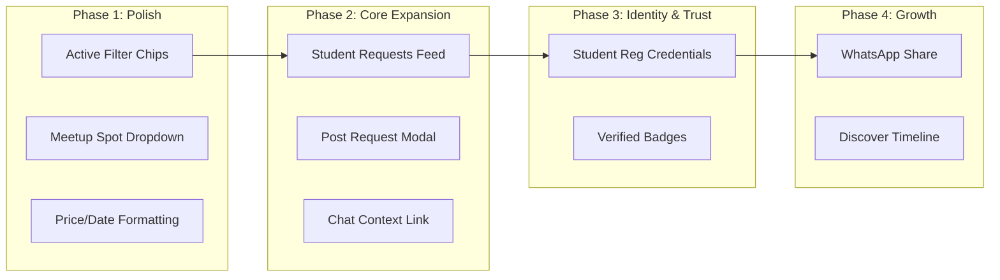

# CampusCart — Feature Blueprint & Implementation Plan

> **Strategic Implementation Plan & Feature Blueprint**  
> **Target Project:** `CampusCart` (`D:\PROJECTS\WAD_MiniProject\CampusCart`)  
> **Scope:** Pure Peer-to-Peer Campus Marketplace (Excludes Academic Notes/PYQ hierarchies)  
> **Architecture Constraint:** 100% non-breaking integration with existing Express/MongoDB backend, AppContext state, and React/Tailwind/Bootstrap frontend.

---

## 1. Executive Summary

`CampusCart` is focused strictly on delivering a fast, trusted, and frictionless **peer-to-peer campus marketplace** for physical items (textbooks, lab equipment, electronics, hostel essentials, sports gear, and cycles). 

By excluding academic notes and focusing purely on commerce and campus lifecycle exchanges, the platform gains laser focus on:
1. **Flipping Marketplace Supply/Demand:** Adding a **Student "Wanted / ISO" (In Search Of) Requests Board** so buyers can solicit items they need immediately.
2. **Zero-Friction Campus Safety:** Incorporating pre-designated **Campus Safe Meetup Zones** (e.g., Central Library Lobby, Student Union, Main Canteen) into listings and chat.
3. **Student Trust & Verification:** Capturing student college credentials (`Department`, `College Year`, `Enrollment ID`) to build high-trust peer transactions.
4. **High-Impact Frontend Polish:** Introducing active filter chips, real-time input error clearing, smart empty states with request fallbacks, and 1-click WhatsApp class sharing.

---

## 2. Selected Marketplace Features & Innovations

### 2.1 Student "Wanted / ISO" (In Search Of) Requests Board
- **What it does:** A dedicated campus bulletin where students post items they urgently need (e.g., *"Need Casio FX-991EX for tomorrow's exam"*, *"Looking for an Engineering Drafter Kit"*).
- **Why it is useful:** In a student community, demand often precedes supply. A wanted board activates passive sellers who own the item but haven't taken the time to create a formal listing.
- **Integration with CampusCart:** Integrated into `BrowsePage` and `SellerHubPage` via a toggle view (*"Items For Sale"* vs. *"Student Requests"*). Clicking *"Fulfill Request / Contact"* launches `ChatModal` with the request ID attached.

---

### 2.2 Designated Campus Safe Meetup Zones
- **What it does:** Provides a curated list of well-lit, public on-campus meeting spots (e.g., *Central Library Lobby*, *Hostel Block A Foyer*, *Student Union Quad*, *Main Canteen*) selectable when listing an item or chatting.
- **Why it is useful:** Eliminates off-campus safety concerns and vague meeting coordinates between buyers and sellers.
- **Integration with CampusCart:** Added as a quick dropdown in `AddListingModal` and as a 1-click suggestion chip inside `ChatModal`.

---

### 2.3 Student Identity & Verification Credentials
- **What it does:** Enriches user profiles with `Department`, `Year / Semester`, `Enrollment Number`, and a `Verified Student` badge.
- **Why it is useful:** Establishes instant peer trust and discourages bad actors or off-campus spammers.
- **Integration with CampusCart:** Extended into `AuthModal` (Register tab) and displayed on `ProductDetailModal` and `SellerHubPage`.

---

### 2.4 Campus Events & Hackathon Noticeboard
- **What it does:** Displays upcoming campus hackathons, workshops, and sports events with attached marketplace tags (e.g., *"Hardware needed for Hackathon 2026"*).
- **Why it is useful:** Connects event excitement with marketplace transactions (e.g., buying sensors, lab coats, sports kits).
- **Integration with CampusCart:** Rendered as an optional banner/carousel on `DiscoverPage`.

---

### 2.5 1-Click WhatsApp Class Share Utility
- **What it does:** Generates a pre-formatted WhatsApp share link with listing title, price, and deep link for rapid sharing across class/hostel groups.
- **Why it is useful:** WhatsApp is the primary communication channel in colleges; this creates organic viral discovery.
- **Integration with CampusCart:** A quick share icon button on `ProductDetailModal` and product cards.

---

### 2.6 Interactive "How CampusCart Works" Flow Visual
- **What it does:** A clean, animated 3-step visual sequence (*Browse/Request → Chat with Peer → Meet on Campus*) on the landing hero section.
- **Why it is useful:** Immediately educates incoming freshmen on safe peer trading without lengthy documentation.
- **Integration with CampusCart:** Positioned on `DiscoverPage` below the hero banner.

---

## 3. Frontend & UX Enhancements

```
┌────────────────────────────────────────────────────────────────────────┐
│                      FRONTEND & UX UPGRADE MATRIX                      │
├─────────────────────────┬────────────────────────┬─────────────────────┤
│ Search & Filters        │ Product Cards          │ Modals & Forms      │
├─────────────────────────┼────────────────────────┼─────────────────────┤
│ • Active Filter Chips   │ • Dual Action Buttons  │ • Real-time Error   │
│   (with "Reset All")    │   (Quick View + Chat)  │   Clearing on Type  │
│ • Live Price Slider     │ • Condition Badges     │ • Safe Spot Picker  │
│ • Department Dropdown   │ • Meetup Location Chip │ • Delete & Reject   │
│ • Smart 0-Result State  │ • Hover Zoom (scale)   │   Confirmation UI   │
└─────────────────────────┴────────────────────────┴─────────────────────┘
```

1. **Active Filter Pills Bar:** Display removable badges for active filters (`Price ≤ ₹1000 ✕`, `Department: CS ✕`) above the grid in `BrowsePage`.
2. **Contextual 0-Result Empty State:** If search returns no items:
   > *"No listings found for 'Drafter'. [ + Post a Student Request ] so peers can reach out to you!"*
3. **Real-time Error Clearing:** Input validation errors disappear as soon as the user starts typing in the field.
4. **Consistent Currency & Date Formatting:** Prices formatted in Indian Rupee format (`₹1,500`) and relative dates (`"2 hours ago"`).

---

## 4. Prioritized Feature Breakdown

| Feature / Idea | Category | Description | Priority |
| :--- | :--- | :--- | :--- |
| **Student "Wanted / ISO" Board** | Marketplace Feature | Feed where students post items they need with 1-click chat contact | **High** |
| **Campus Safe Meetup Dropdown** | Trust & Safety | Standardized campus meeting spots in listing form and chat | **High** |
| **College Identity Fields** | Profile & Auth | Department, year, and enrollment number in registration | **High** |
| **Active Filter Chips & Reset** | UI / Discovery | Removable filter tags above the browse grid | **High** |
| **Smart Empty State with CTA** | UX Flow | Fallback to "Post Request" when search has zero results | **High** |
| **WhatsApp Group Share Utility** | Viral Growth | 1-click pre-formatted text share to WhatsApp | **Medium** |
| **Interactive Flow Timeline** | UI Storytelling | 3-step animated marketplace journey on Discover page | **Medium** |
| **Campus Events Notice Grid** | Community Hub | Hackathons & fests bulletin with gear-matching tags | **Medium** |
| **Delete / Sold Confirmation Modal** | Small Polish | Safety prompt before deleting a listing or rejecting an offer | **Medium** |
| **Skeleton Loading Shimmers** | Visual Polish | Shimmer placeholders during API fetch states | **Low** |
| **Campus FAQ Accordion** | Documentation | Expandable FAQ on safe trade tips and rules | **Low** |

---

## 5. Detailed Step-by-Step Implementation Plan

This implementation plan is organized into **4 actionable stages** designed to preserve your existing architecture.

---

### Stage 1: Quick UI/UX Wins (Non-breaking, Immediate Polish)

#### Task 1.1: Active Filter Chips Bar & Smart Reset
- **Location:** `frontend/src/components/pages/BrowsePage.jsx`
- **Action:**
  - Above the product grid, render pill badges for any active filters (`selectedCategory`, `selectedDept`, `maxPrice`, `searchQuery`).
  - Add a `"Clear All"` button that resets all filters in one click.
  - Implement a refined empty state: when `filteredProducts.length === 0`, show a friendly graphic and a button to switch to the student requests board or reset filters.

#### Task 1.2: Standardized Campus Meetup Locations
- **Location:** `frontend/src/services/mockData.js` and `frontend/src/components/modals/AddListingModal.jsx`
- **Action:**
  - Define standard meetup locations:
    ```js
    export const CAMPUS_MEETUP_SPOTS = [
      'Central Library Lobby',
      'Student Union Quad',
      'Main Canteen / Cafeteria',
      'Hostel Block A/B Lounge',
      'Sports Complex Gate',
      'Department Entry Hall'
    ];
    ```
  - Replace raw text input in `AddListingModal` with a clean dropdown + custom location option.

#### Task 1.3: Currency & Relative Date Formatting Utilities
- **Location:** `frontend/src/components/common/` (or helper function)
- **Action:**
  - Ensure all price displays consistently use `₹` with `.toLocaleString('en-IN')`.
  - Format timestamps as `"Just now"`, `"X hours ago"`, or `"Yesterday"`.

---

### Stage 2: Student "Wanted / ISO" Requests Board

#### Task 2.1: Requirements / Requests State & Mock Data
- **Location:** `frontend/src/services/mockData.js` and `frontend/src/context/AppContext.jsx`
- **Action:**
  - Add `INITIAL_REQUESTS` mock dataset containing sample student requests:
    ```js
    {
      id: 'req-1',
      title: 'Need Casio FX-991EX Calculator',
      category: 'Electronics',
      department: 'Mechanical Engineering',
      description: 'Looking for a scientific calculator for upcoming mid-term exams.',
      postedBy: { name: 'Rahul P.', department: 'ME', year: '2nd Year', avatar: '...' },
      postedAt: '2 hours ago',
      urgent: true
    }
    ```
  - Add `requests`, `addRequest`, and `deleteRequest` to `AppContext`.

#### Task 2.2: Requests Feed UI & "Post Request" Modal
- **Location:** `frontend/src/components/pages/BrowsePage.jsx` and new modal `PostRequestModal.jsx`
- **Action:**
  - Add a sub-tab toggle at the top of `BrowsePage`: `[ Browse Listings (12) ]` | `[ Student Requests (6) ]`.
  - In the Requests tab, render request cards featuring: title, department badge, description, student info, urgent chip, and a **"Contact / I Have This"** button.
  - Clicking **"Contact"** opens `ChatModal` pre-populated with context: *"Hi, I saw your request for [Item Name]..."*.

---

### Stage 3: Trust & Campus Identity Credentials

#### Task 3.1: Enhanced Registration Fields
- **Location:** `frontend/src/components/modals/AuthModal.jsx`
- **Action:**
  - Add optional student profile fields during registration:
    - `Department` (Select from predefined list)
    - `College Year / Batch` (1st Year, 2nd Year, 3rd Year, Final Year)
    - `Student Enrollment / ID No.`
  - Store these in `currentUser` state upon login/signup.

#### Task 3.2: Seller Trust Badges
- **Location:** `frontend/src/components/modals/ProductDetailModal.jsx` and `frontend/src/components/pages/SellerHubPage.jsx`
- **Action:**
  - Display the seller's department, year, and verification badge prominently alongside their rating.
  - Add a tooltip explaining the badge (*"Verified Campus Student • Department Confirmed"*).

---

### Stage 4: Storytelling, Events & Sharing Utilities

#### Task 4.1: "How CampusCart Works" Visual Timeline
- **Location:** `frontend/src/components/pages/DiscoverPage.jsx`
- **Action:**
  - Add an engaging 3-step process card sequence on `DiscoverPage`:
    1. **1. Discover or Request:** Browse verified listings or post what you need.
    2. **2. Instant Campus Chat:** Connect directly with peers with zero middlemen.
    3. **3. Safe Campus Meetup:** Hand over items at designated campus spots with zero shipping fees.

#### Task 4.2: 1-Click WhatsApp Share Link
- **Location:** `frontend/src/components/modals/ProductDetailModal.jsx`
- **Action:**
  - Add a *"Share to WhatsApp"* button that encodes:
    `https://api.whatsapp.com/send?text=Hey!%20Check%20out%20this%20listing%20on%20CampusCart:%20[Title]%20for%20₹[Price]`

#### Task 4.3: Campus Events & Notice Banner
- **Location:** `frontend/src/components/pages/DiscoverPage.jsx`
- **Action:**
  - Add an optional *"Upcoming Campus Fests & Hackathons"* banner showcasing college events and reminding students to grab needed equipment beforehand.

---

## 6. Implementation Verification Matrix



| Phase | Key Deliverable | Impact on User Experience | Architectural Impact |
| :--- | :--- | :--- | :--- |
| **Phase 1** | Filter Chips, Safe Meetup Spots, Currency Polish | Streamlined browsing, crystal-clear pricing, safe exchanges | Zero backend changes (Frontend only) |
| **Phase 2** | Student "Wanted / ISO" Requests Board | Solves unmet buyer demand, unlocks peer-to-peer requests | Context + Mock state extension |
| **Phase 3** | Student Credentials & Verification Badges | High peer trust, safe on-campus trading | User object property enrichment |
| **Phase 4** | WhatsApp Sharing & Visual Flow Journey | Viral class sharing and clear freshman onboarding | UI components only |

---

*Blueprint updated. Ready for execution whenever you decide to proceed with Phase 1.*
