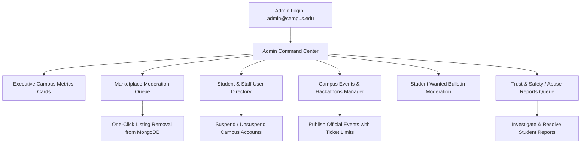
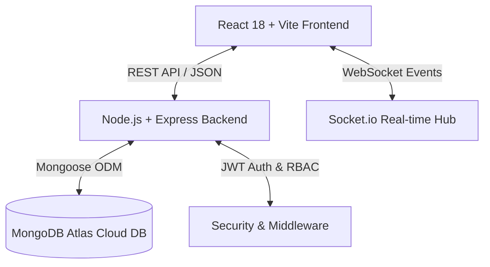

# CampusCart 🎓🛒
> **A Smart, Verified Peer-to-Peer Engineering College Marketplace & Campus Hub**  
> Built as a full-stack **MERN** application compliant with **Web Application Development (WAD - BE05000281)** and **Advanced Database Management System (ADBMS - BE05016031)** specifications using **React.js (Vite)**, **Node.js / Express.js**, **MongoDB Atlas / Mongoose**, **Tailwind CSS**, and **Bootstrap 5**.

[](https://reactjs.org/)
[](https://nodejs.org/)
[](https://www.mongodb.com/)
[](https://tailwindcss.com/)
[](LICENSE)

---

## 📌 Table of Contents
- [✨ Key Features](#-key-features)
- [🛡️ Dedicated Admin Command Center](#️-dedicated-admin-command-center)
- [🏛️ Engineering Departments Supported](#️-engineering-departments-supported)
- [🛠️ Tech Stack & Architecture](#️-tech-stack--architecture)
- [📁 Project Directory Structure](#-project-directory-structure)
- [🚀 Quick Start & Installation](#-quick-start--installation)
- [🔐 Test User & Admin Accounts](#-test-user--admin-accounts)
- [📡 API Endpoints Reference](#-api-endpoints-reference)
- [🗄️ MongoDB Database Schemas](#️-mongodb-database-schemas)
- [🌐 Production Cloud Deployment Guide](#-production-cloud-deployment-guide)
- [🎓 Academic Syllabus & Curriculum Mapping (WAD & ADBMS)](#-academic-syllabus--curriculum-mapping-wad--adbms)
  - [1. Web Application Development (WAD - BE05000281)](#1-web-application-development-wad--subject-code-be05000281)
  - [2. Advanced Database Management System (ADBMS - BE05016031)](#2-advanced-database-management-system-adbms--subject-code-be05016031)
- [📄 License & Authors](#-license--authors)

---

## ✨ Key Features

### 1. 🎓 Role-Based Authentication & Privacy-First Security
- **Dual Role Access Control**: Clear switchable roles for **🎓 Student** and **🛡️ Campus Administrator / Faculty**.
- **Institutional Verification**: Account tagging with verified college email, engineering branch/department, academic year, and student roll number.
- **Forgot Password Recovery**: 6-digit cryptographic verification code generation and password reset saved securely to MongoDB with bcrypt hashing.
- **Clean Form UX**: Blank password fields by default with zero automatic pre-fills.

### 2. 📸 Interactive Campus Image Picker & Smart Fallbacks
- **Multi-Mode Image Picker**:
  - **Upload Tab**: Drag-and-drop or browse image files from device (PNG, JPG, WEBP < 5MB) with instant preview.
  - **Campus Presets Tab**: Quick selection of curated campus items (Calculus books, TI graphing calculators, mechanical keyboards, headphones, desk lamps, bicycles, lab coats).
  - **Paste URL Tab**: Optional external image URL input.
- **Smart Category Fallback**: When an image is skipped, CampusCart automatically assigns an appropriate high-quality photo based on the selected category.
- **Debounced Submissions**: Submissions are debounced and disabled while publishing to prevent duplicate listings.

### 3. 🛒 Isolated Shopping Cart, Wishlist & Notifications per Account
- **Account Isolation**: Shopping carts, wishlist favorites, private listings, and notifications are dynamically isolated per authenticated user session (`campuscart_cart_<email>`, `campuscart_notifications_<email>`), ensuring zero data leakage across account switches.

### 4. 🔔 Live User-Scoped Notifications
- **Real-Time Notification Feed**:
  - **`🛒 New Purchase Request`**: Alerts sellers immediately when a buyer places an offer on their listing.
  - **`🎉 Order Accepted!`**: Alerts buyers when the seller accepts their proposal and readies meetup.
  - **`❌ Order Declined`**: Alerts buyer if an offer is declined.
  - **`✅ Item Marked Sold`**: Confirms transaction completion and ledger ownership update.
  - **`🎪 Event Pass Confirmed`**: Instant digital ticket confirmation.
  - **`💬 New Message`**: Direct peer chat notification.
  - **`🛡️ Safety Report Updated`**: Moderation update notification.

### 5. 🗄️ Real-Time Sales Ledger & Purchase Orders Workflow
- **Multi-Account MongoDB Synchronization**:
  1. Student A posts a listing ➔ Saved to `products` collection in MongoDB.
  2. Student B discovers listing ➔ Sends purchase request ➔ Stored in `orders` collection (`status: "pending"`).
  3. Student A accepts & marks item **SOLD** ➔ Product status updates to `"sold"` and order to `"completed"`.
  4. Student B's **Dashboard ➔ My Purchases** displays the bought item with verified ownership.

### 6. 🚨 Safety & Abuse Reporting Loop
- **Student Report Drawer**: Flag suspicious or prohibited listings directly from the product detail modal with categories (*Misleading Price*, *Prohibited Item*, *Counterfeit*, *Spam*).
- **Direct Moderation Queue**: Reports are saved to MongoDB `/api/reports` and appear immediately in the **Admin Command Center** for investigation and resolution.

### 7. 🎟️ Dedicated Campus Events Hub & Digital QR Passes
- **Official Events Marketplace**: Standalone section for technical symposiums, hackathons, coding workshops, cultural fests, and sports tournaments.
- **Instant Digital QR Passport**: Students can register with 1-click and receive a digital ticket pass with a unique QR code and Ticket ID (e.g. `TKT-PASS-8921`) ready to download or print for entry.

### 8. 📢 Student Wanted Bulletin (In Search Of - ISO)
- **Live Peer Requirement Broadcast**: Post requests for out-of-stock items (specific textbook editions, mini-drafters, roller scales, Arduino kits).
- **Branch & Urgency Badges**: Filter requests by engineering department and urgency level.

### 9. 💬 In-App Peer Chat & Safe Meetup Spots
- **Direct Peer Messaging**: Negotiate prices, arrange item testing, and schedule campus meetups.
- **1-Click Meetup Chips**: Suggested daylight campus zones (*Central Library Lobby*, *Student Union Quad*, *Engineering Complex Foyer*, *Main Canteen*).

### 10. 🛡️ Interactive FAQ, Dark Theme & Math CAPTCHA
- **Dynamic Dark/Light Mode**: Seamless theme switching with high-contrast badge colors and zero color overlapping.
- **Interactive FAQ**: Search and filter by *Trust*, *Buying & Selling*, *Meetups*, *Pricing*, and *Events*.
- **Anti-Spam Math CAPTCHA**: Dynamic arithmetic challenge on listing submissions to prevent bot abuse.

---

## 🛡️ Dedicated Admin Command Center

Campus Administrators (`admin@campus.edu`) have an isolated **Admin Command Center** (`activeTab === 'admin'`) with administrative controls:



- **Executive Analytics Overview**: Live MongoDB statistics for Total Users, Active Listings, Orders & Volume, Campus Events, and Safety Reports.
- **Marketplace Listings Moderation**: Search, filter by branch, and permanently remove problematic listings.
- **User Directory & Account Suspension**: View student emails, departments, ratings, and toggle suspension status.
- **Campus Events Hub**: Official administrative event creator with ticket capacities and scheduling.
- **Abuse Reports Queue**: View flagged listings/users and mark issues as resolved.

---

## 🏛️ Engineering Departments Supported

CampusCart is tailored for engineering universities and supports all 11 core disciplines:

| Branch Code | Department Name | Key Academic Essentials |
| :--- | :--- | :--- |
| **CS** | Computer Science & Engineering (CSE / CS) | DSA Guides, Dev Boards, Tech Books |
| **IT** | Information Technology (IT) | Web Dev, Networking, Cloud References |
| **AIML** | Artificial Intelligence & Machine Learning | Python, GPU Modules, Math Textbooks |
| **EC** | Electronics & Communication Engineering (ECE / EC) | Breadboards, Microcontrollers, DMMs |
| **ME** | Mechanical Engineering (ME) | Mini-Drafters, Roller Scales, Thermodynamics Guides |
| **EE** | Electrical Engineering (EE) | Transformer Kits, Multimeters, Circuit Guides |
| **IC** | Instrumentation & Control Engineering (IC) | Sensors, PLCs, Measurement Tools |
| **Auto** | Automobile Engineering | Mechanics Manuals, CAD Tools, Drafting Gear |
| **Civil** | Civil Engineering | Surveying Tools, Compass Sets, Steel Design Books |
| **Robo** | Robotics & Automation Engineering | Arduino / Raspberry Pi, Servos, Motor Drivers |
| **Env** | Environmental Engineering | Chemistry Kits, Hydrology Manuals, Ecology Guides |

---

## 🛠️ Tech Stack & Architecture



- **Frontend**: React 18, Vite, React-Bootstrap, Tailwind CSS, Lucide Icons, Material Symbols.
- **Backend**: Node.js, Express.js (MVC Architecture), CORS, Cookie Parser, Morgan.
- **Database**: MongoDB Atlas with Mongoose ODM (10+ Collections).
- **Authentication**: JWT (JSON Web Tokens), Bcrypt.js password hashing, Role-Based Access Control (RBAC).
- **State Management**: React Context API (`AppContext`) with dynamic local cache synchronization.

---

## 📁 Project Directory Structure

```
CampusCart/
├── frontend/                         # React Vite Single Page Application
│   ├── public/
│   │   ├── _redirects                # Netlify SPA redirect rules
│   │   ├── logo.svg                  # Custom CampusCart Brand Logo
│   │   └── favicon.svg
│   ├── src/
│   │   ├── components/
│   │   │   ├── common/
│   │   │   │   ├── CampusCartLogo.jsx     # Scalable Vector Brand Logo
│   │   │   │   ├── CaptchaWidget.jsx      # Math Anti-Spam Verification
│   │   │   │   ├── ScrollToTop.jsx        # Smooth Floating Scroll Button
│   │   │   │   └── ToastNotification.jsx  # Floating User Feedback Alerts
│   │   │   ├── layout/
│   │   │   │   ├── Navbar.jsx             # Top Navbar with Live Notifications Dropdown & Admin Center
│   │   │   │   └── Footer.jsx             # Comprehensive SEO & Campus Links Footer
│   │   │   ├── modals/
│   │   │   │   ├── AddListingModal.jsx    # Image Picker (Upload, Presets, URL) + CAPTCHA
│   │   │   │   ├── AuthModal.jsx          # Login/Signup/Forgot Password Modal
│   │   │   │   ├── CartModal.jsx          # Shopping Bag & Checkout Flow
│   │   │   │   ├── ChatModal.jsx          # Live Student Chat & Meetup Chips
│   │   │   │   ├── CreateEventModal.jsx   # Admin Event Creation Form
│   │   │   │   ├── EventTicketModal.jsx   # Digital QR Ticket Pass (Print/PDF)
│   │   │   │   ├── PostRequestModal.jsx   # Student Wanted ISO Requirement Form
│   │   │   │   ├── ProductDetailModal.jsx # Full Item Details, WhatsApp, Chat & Report Drawer
│   │   │   │   └── WishlistModal.jsx      # User Saved Items Overlay
│   │   │   └── pages/
│   │   │       ├── AdminPage.jsx          # Dedicated Admin Command Center Dashboard
│   │   │       ├── BrowsePage.jsx         # Catalog Search, Price Slider & Filters
│   │   │       ├── DiscoverPage.jsx       # Hero, Bento Grid, How It Works & FAQ
│   │   │       ├── EventsPage.jsx         # Dedicated Campus Events Hub
│   │   │       └── SellerHubPage.jsx      # Seller Metrics, Sales Orders & Purchased Items
│   │   ├── context/
│   │   │   └── AppContext.jsx             # Global State & User Isolation Logic
│   │   ├── services/
│   │   │   ├── api.js                     # Central Axios API Service
│   │   │   └── mockData.js                # Preset Images, Fallbacks & Datasets
│   │   ├── App.jsx                        # Master Component Routing
│   │   ├── main.jsx                       # App Bootstrap Entry
│   │   └── index.css                      # Tailwind & Glassmorphism Styles
│   ├── index.html
│   ├── vercel.json                        # Vercel SPA rewrite rules
│   ├── package.json
│   ├── tailwind.config.js
│   └── vite.config.js
│
├── server/                           # Express.js MongoDB API Server
│   ├── src/
│   │   ├── config/
│   │   │   ├── db.js                      # MongoDB Connection Config
│   │   │   └── socket.js                  # Socket.io Real-Time Hub
│   │   ├── controllers/
│   │   │   ├── adminController.js         # Admin Stats, User Management, Reports Queue
│   │   │   ├── authController.js          # Registration, Login, Role Sync, Forgot PW
│   │   │   ├── chatController.js          # Chat Conversations & Messages
│   │   │   ├── eventController.js         # Event CRUD & Ticket Booking
│   │   │   ├── notificationController.js  # User Notifications & Mark As Read
│   │   │   ├── orderController.js         # Purchase Requests, Accept, Mark Sold
│   │   │   ├── productController.js       # Product CRUD, Search & Filtering
│   │   │   ├── reportController.js        # Safety & Abuse Reports Submission
│   │   │   └── requirementController.js   # Student ISO Requirements
│   │   ├── middlewares/
│   │   │   ├── adminMiddleware.js         # adminOnly Access Guard
│   │   │   ├── authMiddleware.js          # JWT & Role Authorization (protect)
│   │   │   └── errorHandler.js            # Global Error Catcher
│   │   ├── models/
│   │   │   ├── Category.js                # Category Schema
│   │   │   ├── Chat.js                    # Chat Conversation Schema
│   │   │   ├── Event.js                   # Event & Attendee Schema
│   │   │   ├── Message.js                 # Chat Message Schema
│   │   │   ├── Notification.js            # User Notification Schema
│   │   │   ├── Order.js                   # Purchase Order Schema
│   │   │   ├── Product.js                 # Product Listing Schema
│   │   │   ├── Report.js                  # Safety Report Schema
│   │   │   ├── Requirement.js             # Student Wanted ISO Schema
│   │   │   └── User.js                    # User & Role Schema
│   │   ├── routes/
│   │   │   ├── adminRoutes.js             # /api/admin
│   │   │   ├── authRoutes.js              # /api/auth
│   │   │   ├── chatRoutes.js              # /api/chats
│   │   │   ├── eventRoutes.js             # /api/events
│   │   │   ├── notificationRoutes.js      # /api/notifications
│   │   │   ├── orderRoutes.js             # /api/orders
│   │   │   ├── productRoutes.js           # /api/products
│   │   │   ├── reportRoutes.js            # /api/reports
│   │   │   └── requirementRoutes.js       # /api/requirements
│   │   ├── utils/
│   │   │   └── seedData.js                # MongoDB Database Seeder
│   │   └── app.js                         # Express App Setup & Middleware
│   ├── server.js                          # Server Entry Point
│   ├── package.json
│   └── .env.example                       # Environment Variables Template
│
├── .gitignore
└── README.md
```

---

## 🚀 Quick Start & Installation

### Prerequisites
- **Node.js**: v18.0.0 or higher
- **MongoDB**: Local MongoDB instance (`mongodb://127.0.0.1:27017`) or MongoDB Atlas Cloud URI

---

### Step 1: Clone the Repository
```bash
git clone https://github.com/PreetDarji22/CampusCart.git
cd CampusCart
```

---

### Step 2: Setup & Start the Backend API Server
```bash
cd server

# Install backend dependencies
npm install

# (Optional) Seed initial campus data into MongoDB
npm run seed

# Start server in development mode (Runs on Port 5000)
npm run dev
```

The Express API will be live at `http://localhost:5000/api`.

---

### Step 3: Setup & Start the Frontend Client
Open a new terminal window:
```bash
cd CampusCart/frontend

# Install frontend dependencies
npm install

# Start Vite React development server (Runs on Port 3000)
npm run dev
```

Open **[http://localhost:3000/](http://localhost:3000/)** in your web browser.

---

## 🔐 Test User & Admin Accounts

When seeded, the following accounts are available for immediate testing:

| Role | Name | Email | Password | Access Rights |
| :--- | :--- | :--- | :--- | :--- |
| **🎓 Student** | Alex Chen (CS) | `alex@campus.edu` | `password123` | Buy, Sell, Chat, Wishlist, Book Tickets |
| **🎓 Student** | Sarah Jenkins (IT) | `sarah@campus.edu` | `password123` | Buy, Sell, Chat, Wishlist, Book Tickets |
| **🛡️ Admin / Faculty** | Campus Administrator | `admin@campus.edu` | `password123` | **Full Admin Command Center**: Metrics, User Directory & Suspension, Marketplace Moderation, Event Publisher, Reports Queue |

---

## 📡 API Endpoints Reference

### Authentication (`/api/auth`)
- `POST /api/auth/register` — Register a new student or admin account.
- `POST /api/auth/login` — Authenticate and receive JWT session.
- `POST /api/auth/forgot-password` — Generate 6-digit password reset code.
- `POST /api/auth/reset-password` — Verify code and save new hashed password.

### Products (`/api/products`)
- `GET /api/products` — Retrieve all listings with search, category, and department filters.
- `GET /api/products/:id` — Get detailed product specifications and seller profile.
- `POST /api/products` — Create a new listing (Authenticated).
- `PUT /api/products/:id` — Update listing or mark as SOLD.
- `DELETE /api/products/:id` — Remove listing.

### Orders & Sales (`/api/orders`)
- `GET /api/orders/my-orders` — Fetch incoming sales orders and buyer purchase history.
- `POST /api/orders` — Create a new purchase request / offer.
- `PATCH /api/orders/:id/accept` — Accept buyer's purchase request.
- `PATCH /api/orders/:id/reject` — Reject buyer's purchase request.
- `PATCH /api/orders/:id/complete` — Mark transaction completed & item sold.

### Notifications (`/api/notifications`)
- `GET /api/notifications` — Fetch user notification feed.
- `PATCH /api/notifications/read-all` — Mark all notifications as read.
- `PATCH /api/notifications/:id/read` — Mark specific notification as read.

### Safety & Reports (`/api/reports`)
- `POST /api/reports` — Submit safety / fraud report for a listing.

### Admin Command Center (`/api/admin`)
- `GET /api/admin/stats` — Retrieve executive platform metrics.
- `GET /api/admin/users` — Fetch complete student/staff user directory.
- `PATCH /api/admin/users/:id/suspend` — Toggle account suspension status.
- `DELETE /api/admin/products/:id` — Administrative listing removal.
- `GET /api/admin/reports` — Retrieve moderation reports queue.
- `PATCH /api/admin/reports/:id/resolve` — Resolve or dismiss safety report.

### Campus Events Hub (`/api/events`)
- `GET /api/events` — Fetch all upcoming campus events and seat availability.
- `POST /api/events` — Create an official event posting (*Admin/Faculty Only*).
- `POST /api/events/:id/book` — Register and generate digital ticket passport.

### Student Wanted ISO (`/api/requirements`)
- `GET /api/requirements` — Fetch active student wanted requests.
- `POST /api/requirements` — Broadcast a new wanted gear requirement.

---

## 🗄️ MongoDB Database Schemas

- **`User`**: Name, Email, Password (bcrypt), Role (`student` / `admin`), Department, Avatar, RollNumber, Phone, isSuspended.
- **`Product`**: Title, Description, Price (INR), Category, Department, Condition, Images, Seller Ref, Status (`available` / `sold` / `removed`).
- **`Order`**: Product Ref, Buyer Ref, Seller Ref, OfferedPrice, Notes, Status (`pending` / `accepted` / `completed` / `rejected`).
- **`Notification`**: User Ref, Title, Message, Type, isRead, Timestamp.
- **`Report`**: Reporter Ref, TargetType, TargetId, Reason, Status (`pending` / `resolved`).
- **`Event`**: Title, Description, Category, Date, Time, Venue, Price, Capacity, RegisteredAttendees, Organizer Ref.
- **`Requirement`**: Title, Description, Department, Budget, Urgency, Requester Ref, Status.
- **`Chat & Message`**: Conversation Participants, Item Ref, Message Body, Timestamp, Read Status.

---

## 🌐 Production Cloud Deployment Guide

| Component | Cloud Platform | Build Command | Output / Root Directory | Key Environment Variables |
|---|---|---|---|---|
| **Database** | MongoDB Atlas (M0 Free) | — | — | `IP: 0.0.0.0/0 (Allow Anywhere)` |
| **Backend API** | Render (Web Service) | `npm install` | `server` | `NODE_ENV=production`, `PORT=5000`, `MONGO_URI`, `JWT_SECRET`, `CLIENT_URL` |
| **Frontend Client** | Vercel | `npm run build` | `frontend` (`dist`) | `VITE_API_URL=https://campuscart-api.onrender.com/api` |

---

## 🎓 Academic Syllabus & Curriculum Mapping (WAD & ADBMS)

CampusCart is engineered to demonstrate complete mastery of the university curriculum across both **Web Application Development (WAD)** and **Advanced Database Management Systems (ADBMS)**.

---

### 1. Web Application Development (WAD) — Subject Code: `BE05000281`

| Module No. | Module Name | Detailed Syllabus Topics Covered | Implementation in CampusCart |
| :---: | :--- | :--- | :--- |
| **Module 1** | **Introduction to Web Technologies** | Evolution of Websites, Client–Server Architecture, Frontend/Backend/Database Overview, Role in Digital Commerce, Static vs Dynamic Websites | Decoupled 3-tier MERN architecture (React Vite SPA ➔ Node/Express API ➔ MongoDB Atlas Cloud Database) with live reactive dynamic state components. |
| **Module 2** | **HTML & CSS Fundamentals** | HTML Document Structure, Semantic Tags (`<header>`, `<main>`, `<section>`, `<footer>`), Forms, Tables, Selectors, Flexbox Layout, Responsive Design, Media Queries, Bootstrap & Tailwind CSS | Full HTML5 semantic structure, Custom Glassmorphism UI, Responsive Tailwind CSS + Bootstrap grid, Dark Mode theme switcher (`index.css`), responsive modals. |
| **Module 3** | **JavaScript Fundamentals** | Variables & Datatypes, Arrays & Objects, DOM Manipulation, Event Handling, Browser LocalStorage, Asynchronous Programming, Promises, Callbacks | React Virtual DOM, User-Scoped `localStorage` caching (`campuscart_cart_<email>`, `campuscart_wishlist_<email>`), Async/Await API orchestration, custom event triggers. |
| **Module 4** | **APIs & HTTP Communication** | Client–Server Communication, HTTP Request/Response, Status Codes (200, 201, 400, 401, 403, 404, 500), Query Parameters & Request Body, CRUD Operations, JSON Handling | RESTful HTTP API with JSON payloads, standard status codes, query filtering (`/api/products?search=&category=`), centralized Axios interceptors for JWT injection. |
| **Module 5** | **Backend Development with Node.js** | Node.js Runtime, npm Package Management, Express.js HTTP Server, Routing & Custom Middlewares, REST API Development, Database Connectivity, Authentication & Authorization | Express.js MVC backend, modular routing (`/api/auth`, `/api/products`, `/api/orders`, `/api/admin`, `/api/reports`), JWT auth middleware (`protect`, `adminOnly`), bcrypt password hashing. |
| **Module 6** | **Frontend Development with React.js** | React 18, JSX Basics, Component-Based Architecture, Functional Components, Props & State, `useState`, `useEffect`, `useCallback`, Conditional Rendering, List Rendering, Axios Integration, CORS | Modern React SPA, Context API (`AppContext`), custom hooks, dynamic modal overlays, live WebSocket / Polling sync, CORS configuration. |
| **Module 7** | **Deployment & Modern Web** | Hosting Basics, Domain Management, SEO Introduction, CAPTCHA Concepts, Cloud Deployment | Math CAPTCHA Anti-Spam Verification widget on listings/requests, Production Cloud Deployment on **Render** (API), **Vercel** (SPA), and **MongoDB Atlas**. |

---

### 2. Advanced Database Management System (ADBMS) — Subject Code: `BE05016031`

| Unit No. | Unit Name | Detailed Syllabus Topics Covered | Implementation in CampusCart |
| :---: | :--- | :--- | :--- |
| **Unit 1** | **Database Architecture & Concurrency** | Client–Server Database Models (2-tier & 3-tier), Concurrency Control Techniques, Lock-Based Protocols, Two-Phase Locking (2PL), Parallel & Distributed Database Fundamentals | 3-tier scalable MERN architecture, optimistic concurrency control in order state transitions, distributed database deployment via MongoDB Atlas replicaset across cloud nodes. |
| **Unit 2** | **Object-Based Databases and Complex Types** | Complex Data Types, Structured Types, Array & Multiset Types, Object Identity (OI), Reference Types, Schema Definition, Nested Queries, Aggregate Functions | Mongoose Schema definitions with ObjectId references (`sellerId`, `buyerId`, `productId`), nested sub-documents (attendees in `Event`, seller profiles in `Product`), array manipulations. |
| **Unit 3** | **Advanced Database Techniques (NoSQL & MongoDB)** | Structured vs Unstructured Data, NoSQL Concepts & Data Modeling, SQL vs NoSQL, MongoDB Architecture, BSON Types, CRUD operations, `find()`, Projections, Query Criteria, Aggregation Pipelines | MongoDB document store with 10+ schemas (`User`, `Product`, `Order`, `Report`, `Event`, `Requirement`, `Notification`, `Chat`), Mongoose aggregations, index optimization, field projection. |
| **Unit 4** | **Advanced Transaction Processing** | ACID Properties in Multi-Document Workflows, Transaction Monitors, Compensating Transactions, Real-Time Transaction Systems, Workflow Recovery | Transactional order flow: Item purchase ➔ Seller acceptance ➔ Status mutation to `"sold"` ➔ Automatic ledger update in buyer ledger with data consistency. |
| **Unit 5** | **Modern Developments in Database Technologies** | Business Intelligence & Metrics, Data Warehousing, Classification & Categorization, Multimedia Databases, Digital Storage | Admin Executive Analytics pipeline aggregating platform metrics, category-wise classification, rich multimedia BSON storage & cloud asset references. |

---

## 📄 License & Authors

This project is created for academic and educational purposes under the **MIT License**.

- **Authors**: Preet Darji, Deepak Valani, Dhairya Koria
- **Repository**: [https://github.com/PreetDarji22/CampusCart](https://github.com/PreetDarji22/CampusCart)

---
*Built with ❤️ as a WAD & ADBMS University Project for campus student communities.*
