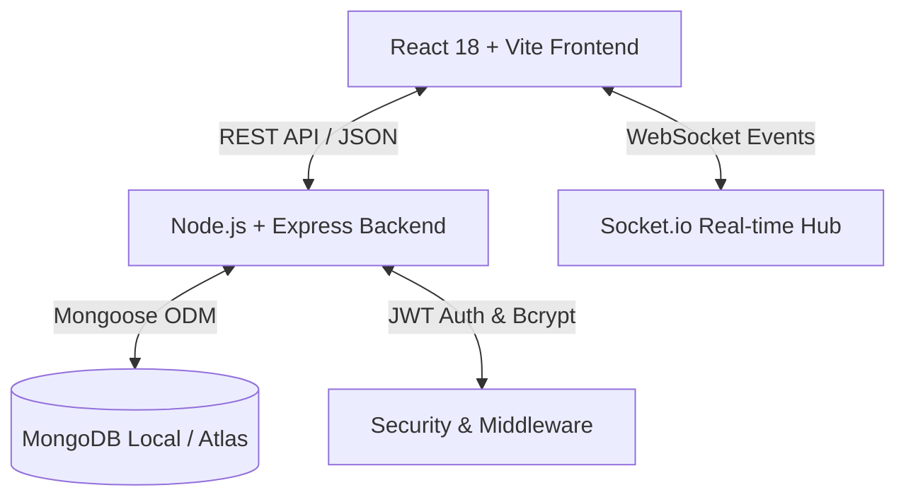

# CampusCart 🎓🛒
> **A Smart, Verified Peer-to-Peer Engineering College Marketplace & Campus Hub**  
> Built as a full-stack **MERN** application compliant with **Web Application Development (WAD)** specifications using **React.js (Vite)**, **Node.js / Express.js**, **MongoDB / Mongoose**, **Tailwind CSS**, and **Socket.io**.

[](https://reactjs.org/)
[](https://nodejs.org/)
[](https://www.mongodb.com/)
[](https://tailwindcss.com/)
[](LICENSE)

---

## 📌 Table of Contents
- [✨ Key Features](#-key-features)
- [🏛️ Engineering Departments Supported](#️-engineering-departments-supported)
- [🛠️ Tech Stack & Architecture](#️-tech-stack--architecture)
- [📁 Project Directory Structure](#-project-directory-structure)
- [🚀 Quick Start & Installation](#-quick-start--installation)
- [🔐 Test User & Admin Accounts](#-test-user--admin-accounts)
- [📡 API Endpoints Reference](#-api-endpoints-reference)
- [🗄️ MongoDB Database Schemas](#️-mongodb-database-schemas)
- [🎓 Academic Syllabus & GTU Compliance](#-academic-syllabus--gtu-compliance)
- [📄 License & Authors](#-license--authors)

---

## ✨ Key Features

### 1. 🎓 Role-Based Authentication & Verification
- **Dual Role Selector**: Dedicated onboarding tabs for **🎓 Student** and **🛡️ Faculty / Admin**.
- **Institutional Trust**: Verification by college email domain, engineering branch, and student roll number.
- **Forgot Password Recovery**: Secure 6-digit verification code generation and password reset saved directly to MongoDB.
- **Privacy-First Forms**: Blank password fields by default with zero automatic pre-fills.

### 2. 🛒 User-Isolated Cart & Wishlist
- **Independent State Persistence**: Shopping cart and wishlist favorites are dynamically isolated per authenticated user account (`campuscart_cart_<userEmail>`), ensuring complete privacy across different accounts and guest sessions.

### 3. 🎟️ Dedicated Campus Events Hub & Digital Passes
- **Events Marketplace**: Standalone section for technical hackathons, coding workshops, cultural fests, and sports tournaments.
- **Admin Event Management**: Faculty and student council admins can publish new events with seat capacities and ticketing fees.
- **Instant Digital QR Passport**: Students can register with 1-click and receive a digital pass with a unique QR code and Ticket ID (e.g. `TKT-HACK-8921`) ready to download or print for entry.

### 4. 📢 Student Wanted Bulletin (In Search Of - ISO)
- **Live Peer Requirement Broadcast**: Post requests for out-of-stock items (specific textbook editions, mini-drafters, roller scales, Arduino kits).
- **Branch & Urgency Badges**: Filter requests by engineering department and urgency level (High / Medium / Normal).

### 5. 💬 Real-Time Peer Chat & Safe Meetup Chips
- **Direct Student-to-Student Messaging**: Negotiate prices, arrange item testing, and schedule campus meetups.
- **1-Click Meetup Chips**: Suggest safe daylight campus zones (*Central Library Lobby*, *Student Union Quad*, *Engineering Complex Foyer*, *Main Canteen*).
- **Price Offers**: Make and counter-offer peer purchase bids in real-time.

### 6. 🛡️ Interactive FAQ & Trust Center
- **Live Search Bar**: Search questions, answers, and guidelines in real-time.
- **Category Filter Badges**: Filter by *Verification & Trust*, *Buying & Selling*, *Campus Meetups*, *Payments & Pricing*, and *Events & Passes*.
- **Visual Process Steps & Pro-Tips**: Clear step cards, green pro-tips, and interactive helpfulness feedback voting (👍 / 👎).

### 7. 🛡️ Anti-Spam Math CAPTCHA Widget
- Interactive arithmetic challenge preventing automated bot submissions when listing products or posting requirements (Module 7 security compliance).

---

## 🏛️ Engineering Departments Supported

CampusCart is tailored for engineering universities and supports all 11 core disciplines:

| Branch Code | Department Name | Key Academic Essentials |
| :--- | :--- | :--- |
| **CSE** | Computer Science & Engineering | DSA Guides, Dev Boards, Tech Books |
| **IT** | Information Technology | Web Dev, Networking, Cloud References |
| **AIML** | Artificial Intelligence & Machine Learning | Python, GPU Modules, Math Textbooks |
| **ECE** | Electronics & Communication Engineering | Breadboards, Microcontrollers, DMMs |
| **ME** | Mechanical Engineering | Mini-Drafters, Roller Scales, Thermodynamics Guides |
| **EE** | Electrical Engineering | Transformer Kits, Multimeters, Circuit Guides |
| **IC** | Instrumentation & Control Engineering | Sensors, PLCs, Measurement Tools |
| **AE** | Automobile Engineering | Mechanics Manuals, CAD Tools, Drafting Gear |
| **CE** | Civil Engineering | Surveying Tools, Compass Sets, Steel Design Books |
| **Robo** | Robotics & Automation Engineering | Arduino / Raspberry Pi, Servos, Motor Drivers |
| **Env** | Environmental Engineering | Chemistry Kits, Hydrology Manuals, Ecology Guides |

---

## 🛠️ Tech Stack & Architecture



- **Frontend**: React 18, Vite, React-Bootstrap, Tailwind CSS, Lucide / Material Icons.
- **Backend**: Node.js, Express.js (MVC Pattern), CORS, Cookie Parser, Morgan.
- **Database**: MongoDB with Mongoose ODM (10+ Collections).
- **Authentication**: JWT (JSON Web Tokens), Bcrypt.js password hashing, Role-Based Access Control (RBAC).
- **State Management**: React Context API (`AppContext`) with dynamic local cache synchronization.

---

## 📁 Project Directory Structure

```
CampusCart/
├── frontend/                         # React Vite Single Page Application
│   ├── public/
│   │   ├── logo.svg                  # Custom CampusCart Graduation Cart Logo
│   │   └── favicon.svg
│   ├── src/
│   │   ├── components/
│   │   │   ├── common/
│   │   │   │   ├── CampusCartLogo.jsx     # Reusable Scalable Vector Logo
│   │   │   │   ├── CaptchaWidget.jsx      # Math Anti-Spam Verification
│   │   │   │   └── ToastNotification.jsx  # Floating User Feedback Alerts
│   │   │   ├── layout/
│   │   │   │   ├── Navbar.jsx             # Top bar with Navigation, Auth & Badges
│   │   │   │   └── Footer.jsx             # Comprehensive SEO Footer
│   │   │   ├── modals/
│   │   │   │   ├── AddListingModal.jsx    # Add Product with CAPTCHA & Branch
│   │   │   │   ├── AuthModal.jsx          # Login/Signup/Forgot Password Modal
│   │   │   │   ├── CartModal.jsx          # Shopping Bag & Checkout Flow
│   │   │   │   ├── ChatModal.jsx          # Live Student Chat & Meetup Chips
│   │   │   │   ├── CreateEventModal.jsx   # Admin Event Creation Form
│   │   │   │   ├── EventTicketModal.jsx   # Digital QR Ticket Pass
│   │   │   │   ├── PostRequestModal.jsx   # Student Wanted ISO Requirement Form
│   │   │   │   ├── ProductDetailModal.jsx # Full Item Details & Offer Actions
│   │   │   │   └── WishlistModal.jsx      # User Saved Items Overlay
│   │   │   └── pages/
│   │   │       ├── BrowsePage.jsx         # Catalog Search, Price Slider & Filters
│   │   │       ├── DiscoverPage.jsx       # Hero, Bento Grid, How It Works & FAQ
│   │   │       ├── EventsPage.jsx         # Dedicated Campus Events Hub
│   │   │       └── SellerHubPage.jsx      # Seller Metrics & Listing Actions
│   │   ├── context/
│   │   │   └── AppContext.jsx             # Global State & User Isolation Logic
│   │   ├── services/
│   │   │   ├── api.js                     # Central Axios API Service
│   │   │   └── mockData.js                # Fallback Datasets & INR Prices
│   │   ├── App.jsx                        # Master Component Routing
│   │   ├── main.jsx                       # App Bootstrap Entry
│   │   └── index.css                      # Tailwind & Glassmorphism Styles
│   ├── index.html
│   ├── package.json
│   ├── tailwind.config.js
│   └── vite.config.js
│
├── server/                           # Express.js MongoDB API Server
│   ├── src/
│   │   ├── config/
│   │   │   └── db.js                      # MongoDB Connection Config
│   │   ├── controllers/
│   │   │   ├── authController.js          # Registration, Login, Forgot PW
│   │   │   ├── eventController.js         # Event CRUD & Ticket Booking
│   │   │   ├── productController.js       # Product CRUD & Filtering
│   │   │   └── requirementController.js   # Student ISO Requirements
│   │   ├── middlewares/
│   │   │   ├── authMiddleware.js          # JWT & Role Authorization (adminOnly)
│   │   │   └── errorHandler.js            # Global Error Catcher
│   │   ├── models/
│   │   │   ├── Category.js                # Category Schema
│   │   │   ├── Event.js                   # Event & Attendee Schema
│   │   │   ├── Product.js                 # Product Listing Schema
│   │   │   ├── Requirement.js             # Student Wanted ISO Schema
│   │   │   └── User.js                    # User & Role Schema
│   │   ├── routes/
│   │   │   ├── authRoutes.js              # /api/auth
│   │   │   ├── eventRoutes.js             # /api/events
│   │   │   ├── productRoutes.js           # /api/products
│   │   │   └── requirementRoutes.js       # /api/requirements
│   │   ├── utils/
│   │   │   └── seedData.js                # MongoDB Database Seeder
│   │   └── app.js                         # Express App Setup & Middleware
│   ├── server.js                          # Server Entry Point
│   ├── package.json
│   └── .env.example                       # Environment Variables Template
│
├── .gitignore
└── README.md
```

---

## 🚀 Quick Start & Installation

### Prerequisites
- **Node.js**: v18.0.0 or higher
- **MongoDB**: Local MongoDB instance (`mongodb://127.0.0.1:27017`) or MongoDB Atlas URI

---

### Step 1: Clone the Repository
```bash
git clone https://github.com/PreetDarji22/CampusCart.git
cd CampusCart
```

---

### Step 2: Setup & Start the Backend API Server
```bash
cd server

# Install backend dependencies
npm install

# (Optional) Seed initial campus data into MongoDB
npm run seed

# Start server in development mode (Runs on Port 5000)
npm run dev
```

The Express API will be live at `http://localhost:5000/api`.

---

### Step 3: Setup & Start the Frontend Client
Open a new terminal window:
```bash
cd CampusCart/frontend

# Install frontend dependencies
npm install

# Start Vite React development server (Runs on Port 3000)
npm run dev
```

Open **[http://localhost:3000/](http://localhost:3000/)** in your web browser.

---

## 🔐 Test User & Admin Accounts

When seeded, the following accounts are available for immediate testing:

| Role | Name | Email | Password | Access Rights |
| :--- | :--- | :--- | :--- | :--- |
| **🎓 Student** | Alex Chen (CSE) | `alex.chen@campus.edu` | *(Set your own or use login)* | Buy, Sell, Chat, Wishlist, Book Tickets |
| **🎓 Student** | Priya Sharma (ECE) | `priya.sharma@campus.edu` | *(Set your own or use login)* | Buy, Sell, Chat, Wishlist, Book Tickets |
| **🛡️ Admin / Faculty** | Dr. Robert Vance | `admin@campus.edu` | *(Admin Access)* | Post Events, Moderate Listings, Manage Hub |

> [!TIP]
> You can also register any new account instantly with your preferred engineering department.

---

## 📡 API Endpoints Reference

### Authentication (`/api/auth`)
- `POST /api/auth/register` — Register a new student or admin account.
- `POST /api/auth/login` — Authenticate and receive JWT session.
- `POST /api/auth/forgot-password` — Generate 6-digit password reset code.
- `POST /api/auth/reset-password` — Verify code and save new hashed password.

### Products (`/api/products`)
- `GET /api/products` — Retrieve all listings with search, category, and department filters.
- `GET /api/products/:id` — Get detailed product specifications and seller profile.
- `POST /api/products` — Create a new listing (Authenticated).
- `PUT /api/products/:id` — Update listing or mark as SOLD.
- `DELETE /api/products/:id` — Remove listing.

### Campus Events Hub (`/api/events`)
- `GET /api/events` — Fetch all upcoming campus events and seat availability.
- `POST /api/events` — Create an official event posting (*Admin/Faculty Only*).
- `POST /api/events/:id/book` — Register and generate digital ticket passport.

### Student Wanted ISO (`/api/requirements`)
- `GET /api/requirements` — Fetch active student wanted requests.
- `POST /api/requirements` — Broadcast a new wanted gear requirement.

---

## 🗄️ MongoDB Database Schemas

- **`User`**: Name, Email, Password (bcrypt), Role (`student` / `admin`), Department, Avatar, Karma Score.
- **`Product`**: Title, Description, Price (INR), Category, Department, Condition, Images, Seller Ref, Status (`Available` / `Sold`).
- **`Event`**: Title, Description, Category, Date, Time, Venue, Price, Capacity, RegisteredAttendees, Organizer Ref.
- **`Requirement`**: Title, Description, Department, Budget, Urgency, Requester Ref, Status.
- **`Chat & Message`**: Conversation Participants, Item Ref, Message Body, Timestamp, Read Status.

---

## 🎓 Academic Syllabus & GTU Compliance

CampusCart fulfills all requirements for **Web Application Development (GTU BE05000281)**:
- **Module 1 & 2**: HTML5 Semantic Structure, CSS3 Custom Properties, Responsive Layouts, Bootstrap Grid.
- **Module 3**: Client-side state synchronization, DOM manipulation, `localStorage` caching.
- **Module 4 & 5**: Node.js & Express.js RESTful API, MongoDB Mongoose schema design, MVC pattern.
- **Module 6**: Real-time communication and interactive UI components.
- **Module 7**: Anti-Spam Math CAPTCHA validation, JWT security, and Role-Based Access Control.

---

## 📄 License & Authors

This project is created for academic and educational purposes under the **MIT License**.

- **Author**: Preet Darji
- **Repository**: [https://github.com/PreetDarji22/CampusCart](https://github.com/PreetDarji22/CampusCart)

---
*Built with ❤️ for campus student communities.*
